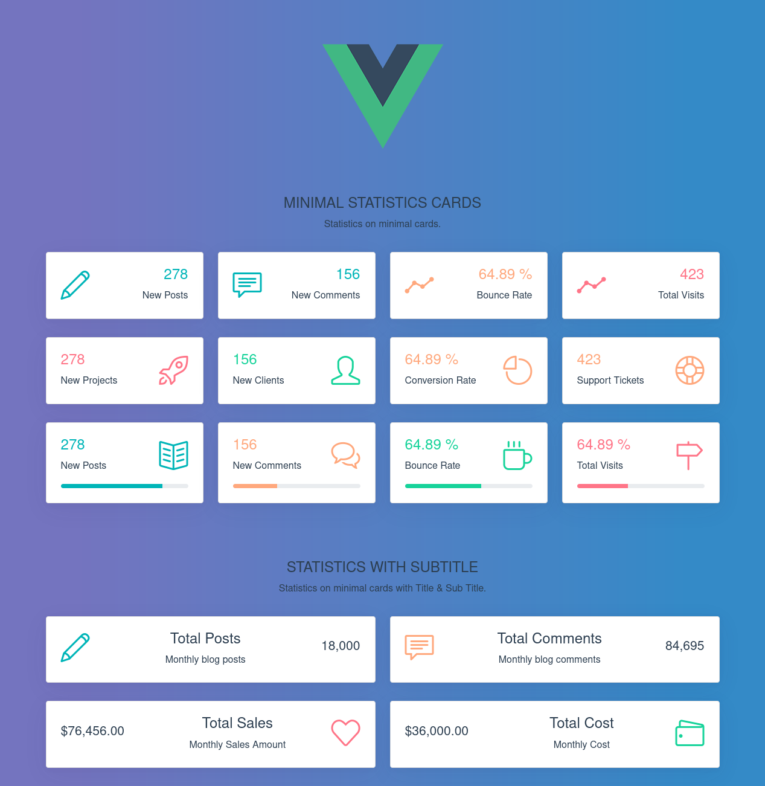

# bootstrap-cards-vue

Vue card components based on [lesliesamafful`s codepen](https://codepen.io/lesliesamafful/pen/oNXgmBG).
Vue + Bootstrap 5.0.0-alpha3 + simple-line-icons, using SASS.
** Without any additional Bootstrap theme.



## Usage

Card
```vue
<card
  title="New Posts"
  value="278" icon-
  class="icon-book-open font-large-2"
  icon-side="right"
  type="primary"
  progress="80"
  progress-min="0"
  progress-max="100" />
```

Card Subtitle
```vue
<card-subtitle
  title="Total Posts"
  subtitle="Monthly blog posts"
  value="18,000"
  icon-class="icon-pencil font-large-2"
  icon-side="left"
  type="primary" />
```

## Project setup
```
yarn install
```

### Compiles and hot-reloads for development
```
yarn serve
```

### Compiles and minifies for production
```
yarn build
```

### Lints and fixes files
```
yarn lint
```

### Customize configuration
See [Configuration Reference](https://cli.vuejs.org/config/).
